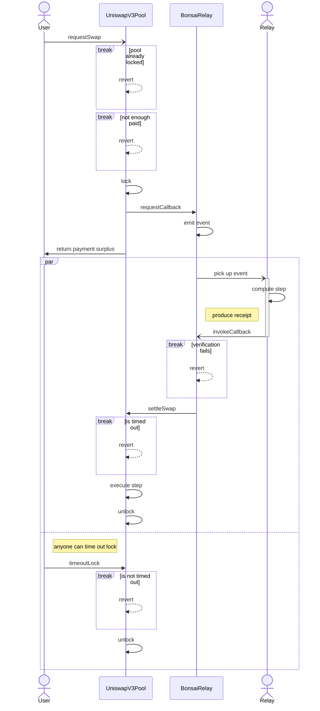

# 🪢 zkUniswap: exploring zkAMMs

<aside>
TL;DR: We introduce zkUniswap, a first-of-its-kind zkAMM that uses a zk co-processor to offload the computation of swaps.

</aside>

## What is *zkUniswap*?

zkUniswap is a research proof-of-concept of a fork of UniswapV3 that uses a zkVM (RISC Zero) to compute part of the swap off-chain. When a user starts a swap, a swap request is made on-chain. This request is picked up by a relay that makes the computation off-chain and then posts the output (and a corresponding proof) to a callback function in the EVM. If the proof is valid, the swap is executed and the request is fulfilled.

## What are *zkAMMs*?

zkAMMs are a variant of Automated Market Makers (AMMs) that integrate zero-knowledge proofs *in-protocol*. This may be done by leveraging a zk co-processor to offload the computation of the swap step, as is the case discussed here. It’s worth noting that, unlike an AMM on a zk-rollup, the verification of the proof is done *by the protocol itself,* allowing it to exist in a medium that does not use zero-knowledge proofs (such as Ethereum Mainnet).

## What is the *point* of zkAMMs?

As computing zk proofs becomes cheaper, it’s possible that in the long-term it becomes cheaper to compute the swap off-chain than do everything on-chain. By allowing us to outsource part of the swap process outside of the EVM, zkAMMs let us escape from the limitations of the EVM without giving up trust guarantees, given that the proofs can be readily verified on-chain.

## What is the *swap step*?

The swap step sits at the core of the execution of a swap. To paraphrase the [documentation](https://github.com/Uniswap/v3-core/blob/main/contracts/libraries/SwapMath.sol#L10) in UniswapV3’s codebase, the swap step outputs the following:

1. The price after swapping the amount in/out
2. The amount to be swapped in
3. The amount to be received
4. The amount of input that will be taken as a fee

Concretely, the step computed by the [swap](https://github.com/Uniswap/v3-core/blob/main/contracts/UniswapV3Pool.sol#L596) function in [UniswapV3Pool](https://github.com/Uniswap/v3-core/blob/main/contracts/UniswapV3Pool.sol): 

```solidity
/// simplified for demonstration purposes
contract UniswapV3Pool {
		function swap(
		    address recipient,
		    bool zeroForOne,
		    int256 amountSpecified,
		    uint160 sqrtPriceLimitX96,
		    bytes calldata data
		) {
				[...]
				(
					state.sqrtPriceX96,
					step.amountIn,
					step.amountOut,
					step.feeAmount
				) = SwapMath.computeSwapStep(
				    state.sqrtPriceX96,
				    (zeroForOne ? step.sqrtPriceNextX96 < sqrtPriceLimitX96 : step.sqrtPriceNextX96 > sqrtPriceLimitX96)
				        ? sqrtPriceLimitX96
				        : step.sqrtPriceNextX96,
				    state.liquidity,
				    state.amountSpecifiedRemaining,
				    fee
				);
				[...]
		}
}
```

The logic is implemented by one of the specialized libraries, [SwapMath](https://github.com/Uniswap/v3-core/blob/main/contracts/libraries/SwapMath.sol).

# Technical Blueprint

## Off-chain zk Co-processor

zkUniswap effectively leverages a zk co-processor to carry out the swap step. The protocol uses a zkVM to run the step as the guest program. The program, written in Rust, and which you can find [here](https://github.com/0xfuturistic/zkUniswap/blob/main/methods/guest/src/bin/swap.rs), uses a [Uniswap V3 math library](https://github.com/0xKitsune/uniswap-v3-math/). 

The zkVM’s prover produces a [receipt](https://dev.risczero.com/terminology#receipt), which includes a journal (where the outputs of the step are committed to) and a seal, which is a zk-STARK. This receipt is used to verify that the step program was executed correctly for the outputs in the journal.

## On-chain Swap Request and Settlement

A user starts a swap by making a request on-chain, which they do by calling [requestSwap](https://github.com/0xfuturistic/zkUniswap/blob/main/contracts/UniswapV3Pool.sol#L513). They pass the same inputs they’d pass to `swap`. The relay, Bonsai, in this case, picks up the request and computes the step off-chain. The relay then posts the data including the outputs and the proof to the function `invokeCallback`. This function verifies the proof, and if it’s considered valid, the callback function that executes the step is called, namely `settleSwap`.

### Proof Verification

A STARK-to-SNARK wrapper is used, such that the seal’s zk-STARK is verified inside a Groth16 prover. This makes the verification of the proofs much more efficient, to the point that we can do it on-chain. The Groth16 verifier, written in Solidity, allows for verifying the proofs as part of the call to `invokeCallback`.

## Concurrency Control

Since the swap is non-atomic, because the request and the execution are made in different transactions because the proving doesn’t happen in the EVM, there’s a risk that the state of the pool changes after the request has been made and before the swap has been executed. This would be highly problematic since the proof is made for the state of the pool at the time the request was made. Thus, if another operation is made on the pool that updates it while a request is pending, the proof to be posted is invalidated.

To prevent these issues, a lock is put on the pool by `requestSwap`, and all operations but `settleSwap` are blocked if a lock is active. This prevents the state of the pool from changing while the swap is in process. The lock is lifted by `settleSwap`, if the callback is successfully called, or it is timed out if the swap hasn’t been completed before a predetermined amount of time went by, defined by `LOCK_TIMEOUT`. Thus, if the relay fails, by becoming unresponsive or posting invalid proofs, the pool is not locked forever. The timeout period could likely be in the order of a few minutes if not seconds, since producing the proof takes a relatively short amount of time.

### Lock Auctioning

Users compete with each other to be able to lock the pool, since a pool can only hold one lock at a time. The first transaction calling `requestSwap` is the one that locks it, and the other ones have to wait for the swap to be settled or for the lock to time out. Since transactions can be reordered by builders, users are likely to want to pay them to include their transactions first. This means that value would be lost to MEV.

zkUniswap, however, takes a different path by auctioning these locks using a Variable Rate Gradual Dutch Auction (VRGDA). This allows the protocol to capture that value by auctioning off the locks directly. Furthermore, these locks are auctioned on a schedule, in series, so that the protocol maximizes the time the pool is locked. If the sales are ahead of schedule, the protocol recognizes this surge in quantity demanded and automatically updates the price to reflect that. Likewise, if sales are lagging, the protocol lowers the price in order to match the quantity demanded. All in all, this proves to be another source of revenue for the protocol.

The auction is carried out by the pool smart contract expecting a transfer of ETH in the calls made to `requestSwap` for at least the price of the lock. If more than necessary ETH is provided, the surplus is atomically returned to the user at the end of the call.

## Swap Flow

We have that interactions with the relay are dealt with on-chain using the `BonsaiRelay` smart contract, which is the gateway from which the relay picks up callback requests (an event emitted) and to where it eventually posts data (specifically, to `invokeCallback`):



## Performance Metrics

The program in the zkVM takes roughly ~154720 cycles. The average amount of gas consumed by `requestSwap` is ~194141 (worst ~254198) and by `settleSwap` is ~64076 (worst ~100000). For reference, an unaltered `swap` call uses about ~71279 (worst ~111330) gas. `requestSwap` can be significantly optimized, which is not the case here since the Bonsai request ends up being more expensive than `swap`.

| UniswapV3Pool contract |  |  |  |  |  |
| --- | --- | --- | --- | --- | --- |
| Function Name | min | avg | median | max | # calls |
| requestSwap | 994 | 194141 | 253905 | 254198 | 29 |
| settleSwap | 31720 | 64076 | 75182 | 100000 | 26 |
| isPoolLocked | 350 | 350 | 350 | 350 | 4 |
| hasLockTimedOut | 661 | 661 | 661 | 661 | 2 |
| swap (unaltered) | 30771 | 71279 | 89511 | 111330 | 21 |

This gas report was done with the optimizer enabled, 20,000 runs, and Solidity version 0.8.17.

# Looking Ahead

This research proof-of-concept shows that it’s currently still too early for zkAMMs to replace traditional AMMs. However, there are several ways this design could be improved upon, leveraging their unique advantages, so that in the future their value proposition becomes much more attractive.

## Swap Parallelization

[Continuations](https://www.risczero.com/news/continuations) could be used to parallelize swaps. Conceptually, continuations allow the [execution trace for a single session of the zkVM to be split into a number of segments, each independently proved](https://dev.risczero.com/terminology#continuations). Swaps with paths independent from each other can each be represented by a [segment](https://dev.risczero.com/terminology#segment) in the zkVM and then these segments could be proven in parallel as part of the broader [session](https://dev.risczero.com/terminology#session). This allows for parallelization of the proving step for a batch of swaps.

Let $n$ be the number of swaps in the batch, $C_{\text{AMM}}$ be the computational cost of traditional AMMs, and  $C_{\text{zkAMM}}$  be the computational cost of zkAMMs. Our hypothesis states that

$$
C_{\text{zkAMM}}=O(\frac{C_{\text{AMM}}}{n})
$$

In essence, the execution of the swaps could be done on-chain in series, but the computation of the actual swap steps would be done in parallel off-chain using this approach. This allows for parallelization of the heaviest part for batches in a way that is not possible natively in the EVM.

As pointed out by [Trace](https://twitter.com/tracecrypto1), it may be the case that for parallel swaps the locks could be auctioned in parallel, since the swaps are touching different pools.

## Differential Privacy

This instantiation of a zkAMM is not private. For that, [we’d need some sort of noise](https://twitter.com/tarunchitra/status/1702840409624305800). While out of the scope of this article, it’s worth pointing out that differential privacy could be achieved by leveraging a privacy-enhancing mechanism like Uniform Random Execution, as outlined [in this paper](https://eprint.iacr.org/2021/1101.pdf).

## Cheap or Gasless Requests

An idea from [William X](https://twitter.com/W_Y_X) is for requests to be propagated on a cheaper, alternative data availability layer (such as an L2) to the one used by the relay to fulfill requests or where the zkAMM lives. This has the potential to reduce costs for making requests.

Another possibility is for users to make requests by producing an EIP712 signature that they propagate off-chain. The relay can then provide this signature while fulfilling the request on-chain. It could then be possible to achieve gasless requests for swaps.

## Getting rid of locks

Another idea independently brought up by [Cairo](https://twitter.com/cairoeth) and [jseam](https://twitter.com/henlojseam) is to not rely on locking the pool and instead have the proofs specify how much the state of the pool can change. This would make the execution of the swap conditional in a similar way to how regular swap transactions specify how much slippage they can accept. 

In this approach, the proof would likely be more expensive to make since we’d possibly be generating a proof for the state of the pool itself rather than just for the swap step. In any case, this trade-off may still make sense for the benefits in UX from getting rid of locks.

## Future Work

- Exploration of differential privacy integration.
- Further optimization of the proof generation process.
- Implementation of parallelization for proving for batched swaps.
- Exploration of alternative implementations of request methods.